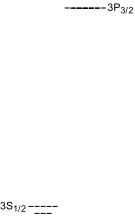
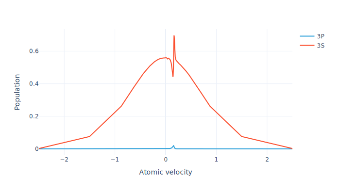

# pyLGS


<!-- WARNING: THIS FILE WAS AUTOGENERATED! DO NOT EDIT! -->

pyLGS performs simulations of the atomic physics of cw, modulated, and
pulsed laser guide stars. The effects of the full atomic structure,
atomic velocity distribution, one or multiple pump fields, the
geomagnetic field, velocity-changing and spin-randomizing collisions,
and atomic recoil are all taken into account.

## Installation

pyLGS uses the CVODE library from the [SUNDIALS
package](https://computing.llnl.gov/projects/sundials), with
[scikits.odes](https://scikits-odes.readthedocs.io/en/latest/installation.html)
as the Python interface. Before installing pyLGS you may need to install
SUNDIALS and the scikits.odes dependencies. On Ubuntu/Debian-based
distributions this can be done with `apt-get`:

``` sh
sudo apt-get install python3-dev gcc gfortran libsundials-dev
```

(Note that at least SUNDIALS version 6 is required – this is supplied by
Ubuntu 24.04/Debian 12 and later.)

Once the above dependencies are installed, pyLGS can be installed with
`pip`:

``` sh
pip install pylgs
```

## How to use

Import the package:

``` python
from pylgs.lgssystem import LGSSystem
```

List available atomic systems for an LGS model:

``` python
LGSSystem.builtins()
```

    ['NaD1', 'Na330', 'NaD2', 'NaD2_Repump', 'NaD1_Toy']

Show a level diagram for one of the atomic systems:

``` python
LGSSystem.diagram("NaD2_Repump", "ToScale")
```



Print some information about the system:

``` python
LGSSystem.info("NaD2_Repump")
```

#### Atomic levels

$\text{3S}_{\frac{1}{2}}$, $\text{3P}_{\frac{3}{2}}$

#### Pump transitions

1.  $\text{3S}_{\frac{1}{2}}\land F=1\to \text{3P}_{\frac{3}{2}}$
2.  $\text{3S}_{\frac{1}{2}}\land F=2\to \text{3P}_{\frac{3}{2}}$

#### Transition wavelengths

- $\text{3P}_{\frac{3}{2}}\to \text{3S}_{\frac{1}{2}}$: 589.158 nm

#### Substructure

- Hyperfine structure included
- Zeeman structure included
- 24 total sublevels

#### Density matrix elements

- All populations included
- All Zeeman coherences (between same level and same F) included
- All hyperfine coherences (between same level and different F)
  neglected
- Optical coherences (between different levels) included for pump
  transitions only
- 374 total density matrix elements

#### Input parameters

- BeamTransitRatePerS
- BFieldG
- MagneticAzimuthDegrees
- MagneticZenithDegrees
- RecoilParameter
- SDampingCollisionRatePerS
- TemperatureK
- VccRatePerS
- DetuningHz1
- DetuningHz2
- EllipticityDegrees1
- EllipticityDegrees2
- IntensitySI1
- IntensitySI2
- LaserWidthHz1
- LaserWidthHz2
- PolarizationAngleDegrees1
- PolarizationAngleDegrees2

Load the atomic system and set values for parameters that will not be
varied:

``` python
lgs = LGSSystem(
    'NaD2_Repump', 
    {
        'EllipticityDegrees1': 45.,
        'PolarizationAngleDegrees1': 0,
        'DetuningHz1': 1.0832e9,
        'LaserWidthHz1': 10.0e6,
        'EllipticityDegrees2': 45.,
        'PolarizationAngleDegrees2': 0,
        'DetuningHz2': -6.268e8 + 1.e8,
        'LaserWidthHz2': 10.0e6,
        'MagneticZenithDegrees': 45.,
        'MagneticAzimuthDegrees': 45.,
        'SDampingCollisionRatePerS': 4081.63,
        'BeamTransitRatePerS': 131.944,
        'VccRatePerS': 28571.,
        'TemperatureK': 185.,
        'RecoilParameter': 1
    }
)
```

Define sample values for the varying parameters:

``` python
params = {'IntensitySI1': 5., 'IntensitySI2': 46., 'BFieldG': 0.5}
```

Build a steady-state model with adaptively refined velocity groups based
on the sample parameters:

``` python
model = lgs.adaptive_stationary_model(params)
```

Solve the model for the steady state using the sample parameters:

``` python
sol = model.solve(params)
```

Find the total return flux:

``` python
model.total_flux(sol).item()
```

    7709.054844667825

Plot the return flux as a function of atomic velocity:

``` python
model.flux_distribution(sol).visualize()
```


Plot the ground and excited state populations as a function of atomic
velocity:

``` python
model.level_population_distribution(sol).visualize()
```



Plot the real and imaginary parts of all density-matrix elements:

``` python
model.velocity_normalize(sol).visualize(line_width=1)
```


